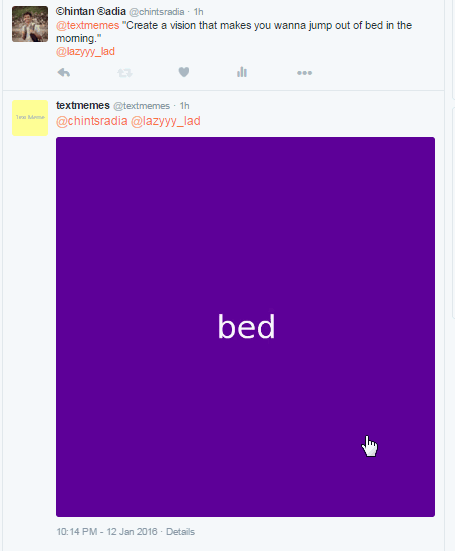

# @textmemes

The Twitter bot to post [Text Memes](https://github.com/beatfreaker/text-meme). Just tag [@textmemes](https://twitter.com/textmemes) in your tweet with "QUOTE".

Example:
- [@textmemes](https://twitter.com/textmemes) "Don't forget to be awesome."

It supports emojis as well :
- [@textmemes](https://twitter.com/textmemes) "❤️ everyone."

## Related

- [text-meme](https://github.com/beatfreaker/text-meme) - node.js API to generate text-meme.
- [text-meme-cli](https://github.com/beatfreaker/text-meme-cli) - CLI utility to generate text-meme.
- [slate](https://github.com/bitshadow/slate) - Inspiration for this module.

## License

MIT © [beatfreaker](https://beatfreaker.github.io)